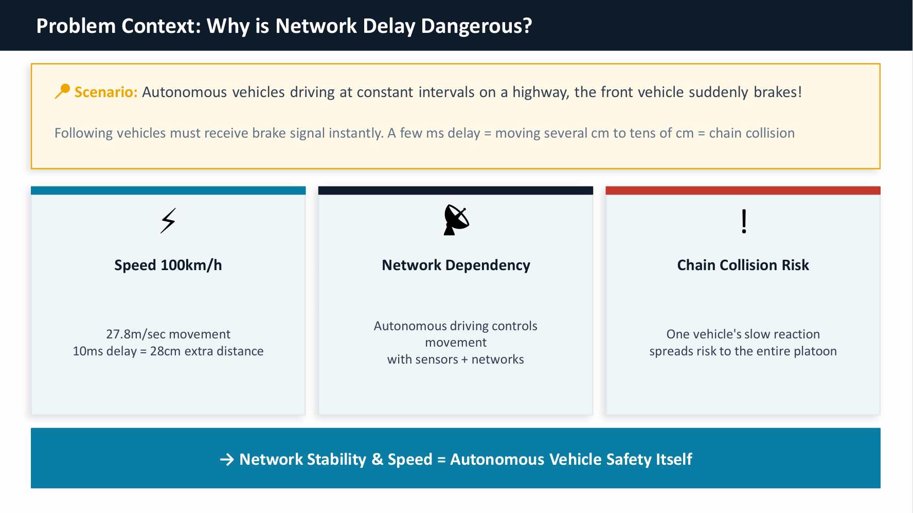
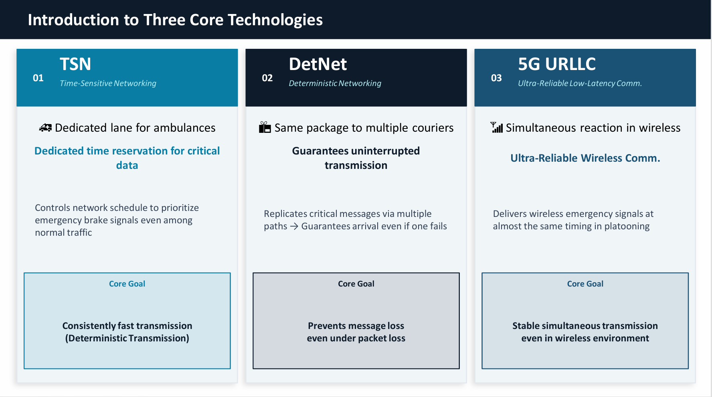
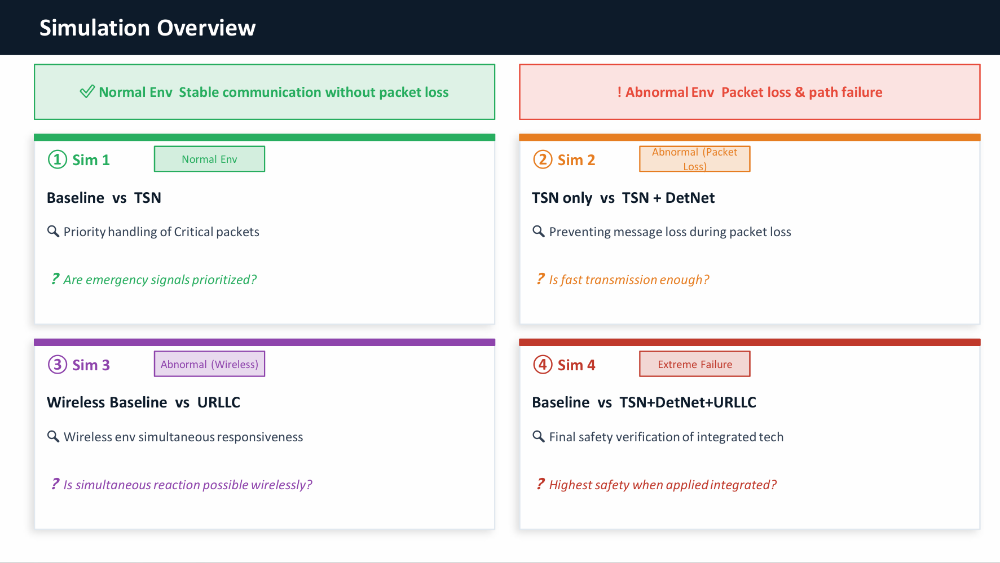
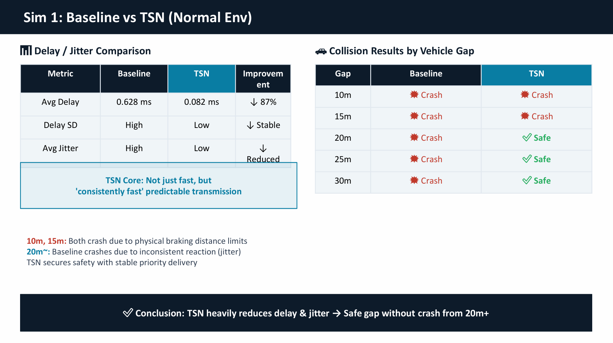
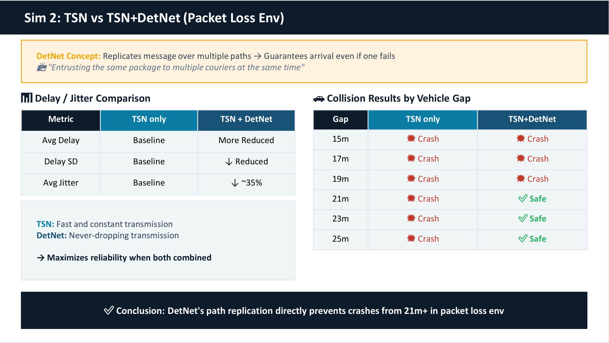
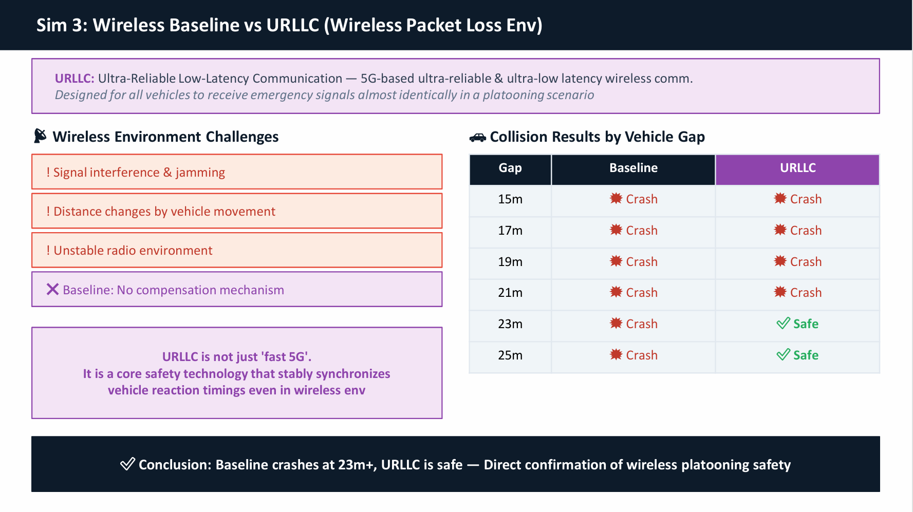
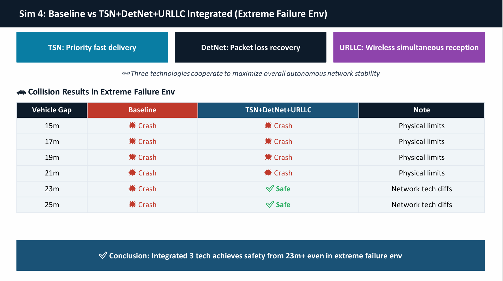

# Analysis and Performance Verification of Latency-Critical Network Technologies for Autonomous Driving Environments

## Final Presentation Video

[Watch the final project presentation video](https://drive.google.com/file/d/14GkgQ983STuGmYNchsO-v1lvOU54-8WZ/view?usp=sharing)

---

## 1. Project Overview

Autonomous driving safety depends not only on vehicle sensors and control algorithms, but also on the reliability and timing of network communication. In a highway platooning scenario, if the leading autonomous vehicle suddenly brakes, the following vehicles must receive the emergency braking message almost immediately.

At 100 km/h, a vehicle moves approximately 27.8 meters per second. Therefore, even a 10 ms communication delay can cause approximately 28 cm of additional travel distance. In a tightly spaced platoon, this additional distance can increase the risk of chain collisions.

This project analyzes and verifies how latency-critical network technologies can improve autonomous driving safety under emergency braking conditions. The project focuses on three representative technologies:

* **TSN (Time-Sensitive Networking)**
* **DetNet (Deterministic Networking)**
* **5G URLLC (Ultra-Reliable Low-Latency Communication)**

Instead of only explaining these technologies conceptually, this repository evaluates them through spacing-based platooning simulations. Each simulation compares a baseline network configuration with an improved latency-critical network configuration.

---

## 2. Problem Definition

Traditional networks are often based on best-effort delivery. In best-effort networks, packets may arrive late, arrive with unstable delay, or be lost depending on congestion, path failure, or wireless instability.

However, autonomous driving requires a stricter communication model. In emergency braking scenarios, the network must satisfy the following requirements:

1. **Low delay**
   Emergency messages must be delivered quickly.

2. **Low jitter**
   Message delivery time must be stable and predictable.

3. **High reliability**
   Critical messages should not disappear even under packet loss or path failure.

4. **Wireless robustness**
   Vehicles must receive emergency messages reliably even in unstable wireless environments.

A network that is only “fast on average” is not sufficient for autonomous driving. If one vehicle receives the emergency message late or fails to receive it, the entire platoon can become unstable. Therefore, autonomous driving networks require communication that is fast, predictable, reliable, and robust under both wired and wireless failure conditions.

---

## 3. Why Network Delay Matters in Autonomous Driving



In human communication, a few milliseconds may seem negligible. In autonomous driving, however, milliseconds directly translate into physical movement.

For example:

* Vehicle speed: **100 km/h**
* Distance moved per second: **27.8 m/s**
* Extra distance caused by 10 ms delay: **approximately 28 cm**

This is why the network is directly connected to vehicle safety. In a platooning scenario, one vehicle’s delayed reaction can propagate backward and cause a chain collision.

Therefore, this project treats network performance not simply as a throughput or speed problem, but as a safety-critical timing problem.

---

## 4. Core Technologies



### 4.1 TSN: Time-Sensitive Networking

TSN is designed to support deterministic communication in wired networks. It can provide scheduled transmission opportunities for critical traffic, similar to how an emergency lane allows ambulances to pass through traffic.

In this project, TSN is used to prioritize emergency braking messages and reduce delay and jitter in wired platooning communication.

**Role in this project:**

> TSN makes critical message delivery fast and predictable.

---

### 4.2 DetNet: Deterministic Networking

DetNet extends deterministic networking concepts beyond a local network. One of its key ideas is improving reliability through packet replication and path redundancy.

In this project, DetNet is used to recover from wired path failure. If one path fails, a duplicated emergency message can still be delivered through another path.

**Role in this project:**

> DetNet prevents critical message loss through redundant transmission paths.

---

### 4.3 5G URLLC: Ultra-Reliable Low-Latency Communication

URLLC is a 5G communication concept designed for ultra-reliable and low-latency wireless services. In autonomous platooning, vehicles must receive emergency messages at almost the same timing.

In this project, URLLC is used to improve wireless emergency message delivery under packet loss conditions.

**Role in this project:**

> URLLC improves reliable and synchronized wireless reaction in autonomous platooning.

---

## 5. Simulation Design



The project evaluates four simulation scenarios.

| Scenario     | Comparison                         | Network Condition                   | Main Question                                                  |
| ------------ | ---------------------------------- | ----------------------------------- | -------------------------------------------------------------- |
| Simulation 1 | Wired Baseline vs TSN              | Normal wired environment            | Can TSN reduce delay and jitter for critical messages?         |
| Simulation 2 | TSN Only vs TSN + DetNet           | Wired path failure / packet loss    | Is fast delivery enough when packets can be lost?              |
| Simulation 3 | Wireless Baseline vs URLLC         | Wireless packet loss                | Can URLLC improve wireless platooning safety?                  |
| Simulation 4 | Overall Baseline vs Integrated LCN | Combined wired and wireless failure | Can TSN + DetNet + URLLC improve safety under extreme failure? |

Each simulation was tested with different vehicle gaps. This is important because collision avoidance depends on both network performance and physical braking distance.

---

## 6. Simulation Environment

The simulation workflow combines vehicle mobility simulation, network simulation, and Python-based orchestration.

| Tool               | Role in This Project                                                                                                                               |
| ------------------ | -------------------------------------------------------------------------------------------------------------------------------------------------- |
| **SUMO**           | Simulates vehicle movement, platoon spacing, emergency braking, speed control, gap measurement, and collision detection                            |
| **ns-3**           | Simulates wireless V2V emergency message reception under normal and failure conditions                                                             |
| **OMNeT++ / INET** | Provides wired TSN and DetNet-related network behavior, including critical message delay and path behavior                                         |
| **Python**         | Integrates the simulation workflow, triggers emergency braking events, applies reaction timing, controls follower vehicles, and generates CSV logs |

The simulation logic is implemented as Python scripts under the [`simulation/`](simulation/) directory.

---

## 7. Repository Structure

```text
latency-critical-network-autonomous-driving/
├── README.md
│
├── docs/
│   ├── midpoint-report.pdf
│   ├── final-presentation.pdf
│   ├── video-link.md
│   └── simulation-video-links.md
│
├── figures/
│   ├── problem-context.png
│   ├── technology-overview.png
│   ├── simulation-overview.png
│   ├── sim1-wired-baseline-vs-tsn.png
│   ├── sim2-tsn-only-vs-tsn-detnet.png
│   ├── sim3-wireless-baseline-vs-urllc.png
│   └── sim4-overall-baseline-vs-integrated-lcn.png
│
├── results/
│   └── result-summary.md
│
├── simulation/
│   ├── README.md
│   ├── scenario-1-wired-baseline-vs-tsn/
│   ├── scenario-2-tsn-only-vs-tsn-detnet/
│   ├── scenario-3-wireless-baseline-vs-urllc/
│   └── scenario-4-overall-baseline-vs-integrated-lcn/
│
└── references/
    └── references.md
```

---

## 8. Simulation 1: Wired Baseline vs TSN



### 8.1 Objective

The first simulation compares a normal wired baseline network with a TSN-applied network under a stable environment without packet loss.

The purpose is to verify whether TSN can prioritize emergency braking messages and reduce delay and jitter.

### 8.2 Related Materials

- Implementation files:
  - Baseline: [`run_wired_baseline_platoon.py`](simulation/scenario-1-wired-baseline-vs-tsn/wired-baseline/run_wired_baseline_platoon.py)
  - TSN: [`run_tsn_platoon.py`](simulation/scenario-1-wired-baseline-vs-tsn/tsn/run_tsn_platoon.py)

- Raw result CSV files:
  - Baseline: [`wired-baseline-summary.csv`](results/raw/scenario-1/wired-baseline-summary.csv)
  - TSN: [`tsn-summary.csv`](results/raw/scenario-1/tsn-summary.csv)

- Simulation videos:
  - [Scenario 1 spacing-based simulation videos](docs/simulation-video-links.md#scenario-1-wired-baseline-vs-tsn)

### 8.3 Delay and Jitter Result

| Metric                   | Baseline |      TSN |   Improvement |
| ------------------------ | -------: | -------: | ------------: |
| Average Delay            | 0.628 ms | 0.082 ms | 87% reduction |
| Delay Standard Deviation |     High |      Low |   More stable |
| Average Jitter           |     High |      Low |       Reduced |

TSN reduced the average delay from 0.628 ms to 0.082 ms, achieving approximately an 87% reduction.

However, the key point is not only that TSN was faster. TSN also reduced delay variation and jitter. This means emergency messages were delivered more consistently, which is critical for synchronized vehicle reaction.

### 8.4 Collision Result

| Vehicle Gap | Baseline | TSN   |
| ----------: | -------- | ----- |
|        10 m | Crash    | Crash |
|        15 m | Crash    | Crash |
|        20 m | Crash    | Safe  |
|        25 m | Crash    | Safe  |
|        30 m | Crash    | Safe  |

At 10 m and 15 m, both configurations resulted in crashes because the physical braking distance was too short. However, from 20 m, TSN maintained safe behavior while the baseline still crashed.

### 8.5 Logical Deduction

The baseline network delivered messages with higher delay and unstable timing. As a result, following vehicles could not react consistently.

TSN reduced both delay and jitter. Therefore, vehicles reacted more predictably to the emergency braking message. This explains why TSN achieved safe behavior from a 20 m vehicle gap, while the baseline still crashed.

**Conclusion:**

> TSN improves autonomous platooning safety by making critical message delivery faster and more predictable.

---

## 9. Simulation 2: TSN Only vs TSN + DetNet



### 9.1 Objective

The second simulation evaluates a wired path failure and packet loss environment. It compares TSN-only communication with TSN + DetNet.

The main question is:

> Is fast and deterministic delivery enough when packets can be lost?

### 9.2 Related Materials

- Implementation files:
  - TSN Only: [`run_tsn_only_wired_failure.py`](simulation/scenario-2-tsn-only-vs-tsn-detnet/tsn-only/run_tsn_only_wired_failure.py)
  - TSN + DetNet: [`run_tsn_detnet_wired_failure.py`](simulation/scenario-2-tsn-only-vs-tsn-detnet/tsn-detnet/run_tsn_detnet_wired_failure.py)

- Raw result CSV files:
  - TSN Only: [`tsn-only-summary.csv`](results/raw/scenario-2/tsn-only-summary.csv)
  - TSN + DetNet: [`tsn-detnet-summary.csv`](results/raw/scenario-2/tsn-detnet-summary.csv)

- Simulation videos:
  - [Scenario 2 spacing-based simulation videos](docs/simulation-video-links.md#scenario-2-tsn-only-vs-tsn--detnet)

### 9.3 Result Summary

| Metric                   | TSN Only | TSN + DetNet              |
| ------------------------ | -------- | ------------------------- |
| Average Delay            | Baseline | More reduced              |
| Delay Standard Deviation | Baseline | Reduced                   |
| Average Jitter           | Baseline | Approximately 35% reduced |

### 9.4 Collision Result

| Vehicle Gap | TSN Only | TSN + DetNet |
| ----------: | -------- | ------------ |
|        15 m | Crash    | Crash        |
|        17 m | Crash    | Crash        |
|        19 m | Crash    | Crash        |
|        21 m | Crash    | Safe         |
|        23 m | Crash    | Safe         |
|        25 m | Crash    | Safe         |

TSN-only communication still resulted in crashes at 21 m, 23 m, and 25 m under packet loss conditions. In contrast, TSN + DetNet achieved safe behavior from a 21 m vehicle gap.

### 9.5 Logical Deduction

The TSN-only configuration can reduce delay for successfully delivered packets. However, if the emergency message is lost due to path failure, reducing delay is meaningless because the follower vehicle never receives the message.

DetNet solves this problem by adding path redundancy. The same critical message can be delivered through multiple paths. Therefore, even if one path fails, the message can still arrive through another path.

This explains why TSN + DetNet achieved safe behavior from 21 m, while TSN-only continued to crash.

**Conclusion:**

> Fast delivery alone is not enough. Autonomous driving networks also require reliable delivery under packet loss and path failure conditions.

---

## 10. Simulation 3: Wireless Baseline vs URLLC



### 10.1 Objective

The third simulation compares a wireless baseline environment with a URLLC-applied wireless environment under wireless packet loss conditions.

The purpose is to verify whether URLLC can improve wireless reliability and synchronized braking behavior in autonomous platooning.

### 10.2 Related Materials

- Implementation files:
  - Wireless Baseline: [`run_wireless_baseline_failure_platoon.py`](simulation/scenario-3-wireless-baseline-vs-urllc/wireless-baseline/run_wireless_baseline_failure_platoon.py)
  - URLLC: [`run_urllc_wireless_failure_platoon.py`](simulation/scenario-3-wireless-baseline-vs-urllc/urllc/run_urllc_wireless_failure_platoon.py)

- Raw result CSV files:
  - Wireless Baseline: [`wireless-baseline-summary.csv`](results/raw/scenario-3/wireless-baseline-summary.csv)
  - URLLC: [`urllc-summary.csv`](results/raw/scenario-3/urllc-summary.csv)

- Simulation videos:
  - [Scenario 3 spacing-based simulation videos](docs/simulation-video-links.md#scenario-3-wireless-baseline-vs-urllc)

### 10.3 Collision Result

| Vehicle Gap | Wireless Baseline | URLLC |
| ----------: | ----------------- | ----- |
|        15 m | Crash             | Crash |
|        17 m | Crash             | Crash |
|        19 m | Crash             | Crash |
|        21 m | Crash             | Crash |
|        23 m | Crash             | Safe  |
|        25 m | Crash             | Safe  |

The wireless baseline crashed at all tested vehicle gaps. URLLC achieved safe behavior from a 23 m vehicle gap.

### 10.4 Logical Deduction

Wireless communication is more unstable than wired communication because it can be affected by interference, mobility, signal degradation, and packet loss.

In the wireless baseline environment, some vehicles failed to receive the emergency braking message or received it too late. This caused inconsistent reaction timing and led to collisions.

URLLC improved the reliability of wireless emergency message delivery. As a result, vehicles were able to react more synchronously from a 23 m gap.

**Conclusion:**

> URLLC is not simply “fast 5G.” In autonomous platooning, it acts as a safety-critical wireless communication mechanism.

---

## 11. Simulation 4: Overall Baseline vs Integrated LCN



### 11.1 Objective

The fourth simulation evaluates the most extreme condition in this project. It compares the overall wired-wireless baseline with an integrated latency-critical network using TSN, DetNet, and URLLC.

This scenario includes both wired path failure and wireless packet loss.

### 11.2 Related Materials

- Implementation files:
  - Overall Baseline: [`run_overall_baseline_combined_failure.py`](simulation/scenario-4-overall-baseline-vs-integrated-lcn/overall-baseline/run_overall_baseline_combined_failure.py)
  - Integrated LCN: [`run_integrated_lcn_combined_failure.py`](simulation/scenario-4-overall-baseline-vs-integrated-lcn/integrated-lcn/run_integrated_lcn_combined_failure.py)

- Raw result CSV files:
  - Overall Baseline: [`overall-baseline-summary.csv`](results/raw/scenario-4/overall-baseline-summary.csv)
  - Integrated LCN: [`integrated-lcn-summary.csv`](results/raw/scenario-4/integrated-lcn-summary.csv)

- Simulation videos:
  - [Scenario 4 spacing-based simulation videos](docs/simulation-video-links.md#scenario-4-overall-baseline-vs-integrated-lcn)

### 11.3 Collision Result

| Vehicle Gap | Overall Baseline | Integrated LCN |
| ----------: | ---------------- | -------------- |
|        15 m | Crash            | Crash          |
|        17 m | Crash            | Crash          |
|        19 m | Crash            | Crash          |
|        21 m | Crash            | Crash          |
|        23 m | Crash            | Safe           |
|        25 m | Crash            | Safe           |

The overall baseline crashed at every tested vehicle gap. The integrated LCN environment achieved safe behavior from a 23 m vehicle gap.

### 11.4 Logical Deduction

The overall baseline fails because it lacks protection against both wired and wireless failures. If a critical message is delayed, lost, or not received wirelessly, follower vehicles cannot react safely.

The integrated LCN combines three complementary functions:

* **TSN** reduces delay and jitter for critical wired traffic.
* **DetNet** improves reliability through redundant paths.
* **URLLC** improves wireless reception under packet loss conditions.

Because these technologies address different failure points, their integration provides stronger safety than any single technology alone.

**Conclusion:**

> The integrated TSN + DetNet + URLLC approach provides the strongest safety improvement under combined wired and wireless failure conditions.

---

## 12. Key Findings

### Finding 1: TSN improves predictable reaction timing

TSN reduced average delay from 0.628 ms to 0.082 ms and reduced jitter. In the normal wired scenario, this allowed safe behavior from a 20 m vehicle gap.

### Finding 2: DetNet is necessary when packets can be lost

TSN alone improves delivery timing, but it cannot recover lost packets. DetNet improved reliability through path redundancy and achieved safe behavior from a 21 m vehicle gap under wired path failure.

### Finding 3: URLLC improves wireless platooning safety

Wireless baseline communication failed under packet loss conditions. URLLC improved wireless message reception and enabled safe behavior from a 23 m vehicle gap.

### Finding 4: Integrated LCN provides the strongest safety result

The integrated TSN + DetNet + URLLC approach achieved safe behavior from a 23 m gap even under combined wired and wireless failure conditions.

---

## 13. Trade-offs

Latency-critical network technologies improve safety, but they also introduce technical trade-offs.

| Technology     | Benefit                                                | Trade-off                                                         |
| -------------- | ------------------------------------------------------ | ----------------------------------------------------------------- |
| TSN            | Reduces delay and jitter for critical traffic          | Requires precise scheduling and time synchronization              |
| DetNet         | Improves reliability through redundant paths           | Increases traffic overhead by duplicating packets                 |
| URLLC          | Improves wireless reliability and low-latency delivery | Requires advanced 5G infrastructure and radio resource management |
| Integrated LCN | Provides the strongest safety improvement              | Increases system complexity and configuration burden              |

### 13.1 TSN Trade-off

TSN can make emergency message delivery more predictable, but it requires careful scheduling. If schedules are poorly configured, the benefit can decrease. TSN also requires time synchronization between network devices.

### 13.2 DetNet Trade-off

DetNet improves reliability by sending duplicated packets through multiple paths. However, this increases network load. Therefore, DetNet is useful for safety-critical messages, but it should be applied selectively to avoid unnecessary overhead.

### 13.3 URLLC Trade-off

URLLC improves wireless reliability, but it depends on advanced 5G infrastructure and strict radio resource control. This makes deployment more complex compared to ordinary wireless communication.

### 13.4 Integrated LCN Trade-off

The integrated approach provides the strongest safety result, but it is also the most complex. It requires coordination between wired scheduling, redundant routing, and wireless reliability mechanisms.

---

## 14. Limitations

This project is a scenario-based simulation study. It does not represent a full production-grade autonomous driving system.

Main limitations include:

* The vehicle control model is simplified.
* The road environment is based on controlled platooning scenarios.
* Real-world wireless interference is simplified.
* The simulation focuses on emergency braking rather than all autonomous driving functions.
* The tested scenarios use fixed vehicle gaps.
* Network slicing, AI-native autonomous networking, and MEC optimization were discussed in the initial project scope but were not the main focus of the final implementation.

Despite these limitations, the project demonstrates the relative safety impact of TSN, DetNet, and URLLC under controlled network failure conditions.

---

## 15. Future Directions

This project verified the safety impact of latency-critical networking technologies under controlled autonomous platooning scenarios. The results show that reducing delay, stabilizing jitter, preventing packet loss, and improving wireless reliability can directly affect collision avoidance.

However, real autonomous driving networks will require a larger and more integrated communication architecture. Based on current industry and standardization trends, this project can be extended in the following directions.

### 15.1 Large-Scale V2X Deployment

A natural extension of this project is to move from a small platooning scenario to a larger V2X environment. Real autonomous driving will not depend only on vehicle-to-vehicle communication. It will also require vehicle-to-infrastructure, vehicle-to-pedestrian, and vehicle-to-network communication.

The U.S. Department of Transportation released a national V2X deployment plan to accelerate vehicle-to-everything technologies for road safety, mobility, and efficiency. This shows that the core idea of this project, delivering safety-critical messages quickly and reliably, is directly connected to real transportation infrastructure development.

Future simulations could include:

- roadside units (RSUs)
- intersections and traffic lights
- pedestrians and cyclists
- emergency vehicles
- mixed traffic with autonomous and human-driven vehicles
- infrastructure-assisted warning messages

This would make the simulation closer to a real connected transportation system.

### 15.2 From Average Latency to Guaranteed Latency

This project compared delay, jitter, packet loss, and collision results. In future autonomous driving networks, the goal should move beyond reducing average latency. The more important requirement is guaranteeing bounded worst-case latency.

IETF DetNet documents describe how packet networks are evolving from bandwidth-guaranteed QoS to latency-guaranteed QoS. This means future networks should not only provide high throughput, but also guarantee that safety-critical packets arrive within a predictable time bound.

Future work could therefore evaluate:

- worst-case end-to-end latency
- bounded jitter
- maximum tolerable delay before collision
- guaranteed delivery deadline for emergency braking messages
- deterministic scheduling under heavy background traffic

This direction would make the project more aligned with deterministic networking research and real safety-critical system requirements.

### 15.3 Scaling TSN and DetNet Beyond a Small Network

This project tested TSN and DetNet in controlled scenarios. However, real roads and smart transportation systems require much larger networks. As the number of vehicles, roadside units, switches, and wireless nodes increases, deterministic communication becomes more difficult.

Future work could extend this project by evaluating large-scale DetNet and TSN environments. The key question would be:

> Can deterministic latency and reliable packet delivery still be guaranteed when the network becomes large and complex?

Important future topics include:

- scalable deterministic routing
- resource reservation for many critical flows
- congestion control for mixed traffic
- packet replication overhead
- synchronization across larger networks
- survivability under multiple simultaneous failures

This is important because DetNet and TSN must eventually operate not only in small test scenarios, but also in city-scale transportation networks.

### 15.4 5G-Advanced and 6G-Based Autonomous Mobility

URLLC is one of the most important wireless technologies for autonomous driving, but wireless communication is still evolving. 3GPP Release 19 is part of the 5G-Advanced evolution and introduces further enhancements across radio access, core networks, and system architecture.

This means that future autonomous driving networks may depend on more advanced wireless systems than the URLLC model tested in this project.

Future research could investigate:

- 5G-Advanced V2X
- 6G ultra-low-latency mobility networks
- integrated sensing and communication
- AI-native radio resource control
- satellite-assisted vehicle communication
- high-mobility handover reliability

This would extend the project from current URLLC-based wireless reliability toward future connected and autonomous mobility networks.

### 15.5 MEC-Based Low-Latency Decision Support

Multi-access Edge Computing (MEC) can place computing resources closer to vehicles and roadside infrastructure. Instead of sending all data to a remote cloud, edge servers can process safety-critical information near the road.

For autonomous driving, MEC could support:

- local traffic prediction
- cooperative perception
- emergency message aggregation
- low-latency decision support
- intersection-level safety control

Future work could integrate MEC into the current simulation structure and compare cloud-based, edge-based, and vehicle-only decision models. This would help evaluate whether edge computing can further reduce end-to-end reaction time in more complex driving environments.

### 15.6 Network Slicing for Safety-Critical Traffic Isolation

In real 5G and future 6G networks, autonomous driving traffic will coexist with ordinary mobile traffic, infotainment traffic, map updates, and sensor data. If all traffic shares the same network resources without isolation, safety-critical messages may be delayed by non-critical traffic.

Network slicing can address this problem by creating a dedicated logical network slice for autonomous driving safety messages.

A future extension could compare:

- ordinary shared network traffic
- dedicated V2X safety slice
- separate infotainment and safety slices
- dynamic resource allocation between slices
- slice failure and recovery scenarios

This would extend the current project from packet-level reliability to service-level network architecture.

### 15.7 AI-Based Network Failure Prediction and Adaptive Control

The current project uses predefined failure scenarios such as wired path failure, wireless packet loss, and combined failure. In real systems, failures may appear gradually through congestion, signal degradation, or abnormal jitter patterns.

AI-based network monitoring could predict these failures before they directly affect emergency messages.

Future research could combine latency-critical networking with AI-based control by using:

- congestion prediction
- packet loss prediction
- adaptive routing
- dynamic priority adjustment
- automatic failover between wired, wireless, and redundant paths
- anomaly detection for unstable V2X links

This would turn the network from a static safety mechanism into an adaptive safety system.

### 15.8 More Realistic Vehicle and Traffic Models

This project focused on emergency braking in a simplified platooning environment. This was useful for isolating the relationship between network delay and collision risk. However, real autonomous driving includes more complex vehicle behavior.

Future simulations could include:

- adaptive cruise control
- lane changing
- multi-lane roads
- curved roads
- urban intersections
- sensor fusion delays
- heterogeneous vehicle types
- human-driven vehicles mixed with autonomous vehicles

This would make the safety analysis more realistic and would help evaluate how latency-critical networks perform under diverse driving conditions.

### 15.9 Summary of Future Direction

The future of autonomous driving networks is not simply about faster communication. The more important direction is building a communication system that can guarantee safety-critical performance under real-world uncertainty.

This project can be extended from controlled platooning simulations toward a larger architecture that includes:

- V2X infrastructure deployment
- guaranteed latency and bounded jitter
- scalable TSN and DetNet
- 5G-Advanced and 6G mobility communication
- MEC-based edge intelligence
- network slicing for safety traffic
- AI-based adaptive network control
- realistic traffic and vehicle dynamics

Therefore, the long-term direction is clear:

> Autonomous driving networks must evolve from best-effort connectivity to deterministic, reliable, adaptive, and safety-aware communication systems.

---

## 16. Additional Materials

* [Final presentation slides](docs/final-presentation.pdf)
* [Midpoint report](docs/midpoint-report.pdf)
* [Final presentation video](docs/video-link.md)
* [Simulation video links](docs/simulation-video-links.md)
* [Simulation result summary](results/result-summary.md)
* [Simulation code directory](simulation/)
* [Raw simulation result CSV files](results/raw/)

---

## 17. Conclusion

This project shows that latency-critical network technologies are not only performance-enhancing mechanisms. In autonomous driving environments, they directly affect vehicle safety.

The simulation results show the following:

* TSN improves predictable emergency message delivery.
* DetNet improves reliability under packet loss and path failure.
* URLLC improves wireless platooning stability.
* The integrated LCN approach provides the strongest safety result under extreme network failure conditions.

Therefore, future autonomous driving networks should not focus only on bandwidth or average speed. They must also guarantee predictable latency, message reliability, and wireless robustness for safety-critical scenarios.

---

## 18. References

[1] IEEE 802.1 Time-Sensitive Networking Task Group.
https://1.ieee802.org/tsn/

[2] IEEE P802.1DG - TSN Profile for Automotive In-Vehicle Ethernet Communications.
https://1.ieee802.org/tsn/802-1dg/

[3] IETF RFC 8655 - Deterministic Networking Architecture.
https://www.rfc-editor.org/rfc/rfc8655

[4] IETF RFC 9320 - Deterministic Networking Bounded Latency.
https://www.rfc-editor.org/rfc/rfc9320

[5] IETF RFC 9566 - DetNet Packet Replication, Elimination, and Ordering Functions.
https://www.rfc-editor.org/rfc/rfc9566

[6] 5G Americas. Understanding 5G and Time Critical Services.
https://www.5gamericas.org/understanding-5g-time-critical-services/

[7] Network Latency in Teleoperation of Connected and Autonomous Vehicles: A Review of Trends, Challenges, and Mitigation Strategies.
https://www.mdpi.com/1424-8220/24/12/3957

[8] Time-Sensitive Networking Experiment in Sensor-Based Integrated Environment for Autonomous Driving.
https://pmc.ncbi.nlm.nih.gov/articles/PMC6427734/

[9] ETSI White Paper: AI in the Evolution of Autonomous Networks.
https://www.etsi.org/images/files/ETSIWhitePapers/ETSI-WP-69-AI-in_the_evolution_of_Autonomous_Networks.pdf

[10] OMNeT++ Discrete Event Simulator.
https://omnetpp.org/

[11] ns-3 Network Simulator.
https://www.nsnam.org/

[12] SUMO: Simulation of Urban Mobility.
https://www.eclipse.org/sumo/
